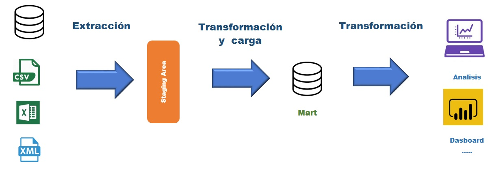

```{r setup, include=FALSE}
knitr::opts_chunk$set(echo = TRUE)

suppressWarnings(library(magrittr))
suppressWarnings(library(dplyr))
suppressWarnings(library(readxl))
suppressWarnings(library(tidyr))
suppressWarnings(library(DT))
suppressWarnings(library(kableExtra))
suppressWarnings(library(formattable))
suppressWarnings(library(knitr))
suppressWarnings(library(kableExtra))
suppressWarnings(library(rpivotTable))
suppressWarnings(library(gt))
suppressWarnings(library(reactable))
suppressWarnings(library(flextable))


setwd("C:/Users/oscar/Desktop/R --- SAF/Tema 4")

data <- read_excel("data.xlsx")
```


<style>
table {
background-color:#FFFFFF;
}
</style>

<style>
.list-group-item.active, .list-group-item.active:focus, .list-group-item.active:hover {
    background-color: darkblue;
}
</style>

<button onclick="document.body.scrollTop = document.documentElement.scrollTop = 0;" style="
    position: fixed;
    bottom: 5px;
    right: 40px;
    text-align: center;
    cursor: pointer;
    outline: none;
    color: #fff;
    background-color: #0A71A0;
    border: none;
    border-radius: 15px;
    
">Ir arriba</button>

# {.tabset .tabset-fade .tabset-pills}

El presente tema expone la representación tabular.  Se abordarán los puntos:

- La tabla "clásica".
- Otras formas más elegantes de presentar la información.
- La tabla dinámica o pivot table.


Al finalizar la sesión se estará en capacidad de poder presentar de mejor forma los resultados tabulares provientes, ya sea 
de un arreglo de datos, o de un determinado análisis de la información.


## **Al final del ETL...** {.tabset .tabset-fade .tabset-pills}


Finalizada la etapa de la transformación de los datos, podemos pensar dos cosas:

- ¡YUUUUUUUUUUUUPI!
- Debemos ahora darle valor a la información ... (es una postergación del yupi....)

Volvamos a ver nuestro diagrama del ETL:

----------------------------------------------------------------------------------------------------------



Estamos en la etapa de brindarle valor a nuestra información. Dentro de los métodos clásicos tenemos:

- Cuadros o tablas (tabla = *table* , .... es un forma gringa de expresarlo...).
- Gráficos.

Nos centraremos en aportar valor a la información mediante las tablas.


## **Tabla clásica** {.tabset .tabset-fade .tabset-pills}


Detengámos un momento, y respondamos con total franqueza : 

... ¿les gusta la forma en cómo se representa de manera tabular la siguiente información?

#### Ejemplo 1: datos "data"

La tabla "data" es la siguiente

```{r echo=FALSE, warning=FALSE}
data
```

¿Que consideran al respecto? Mencionen por lo menos 3 falencias...

#### Ejemplo 2: mtcars

```{r echo=FALSE, warning=FALSE}
mtcars
```

¿Que consideran al respecto?

#### Ejemplo 3: iris

```{r echo=FALSE, warning=FALSE}
iris
```

¿Que consideran al respecto?

#### **Mejores la visualización tabular... ¡POR FAVOR!**

El presente tema aborda otras técnicas para mejorar la presentación de la información tabular. Buscamos obtener a una tabla realmente hermosa.

----------------------------------------------------------------------------------------------------------------------------------------------------------


## **DT** {.tabset .tabset-fade .tabset-pills}


El paquete **DT** proporciona una interfaz creada a partir de código *JavaScript*: el DataTables o DT. 

Los objetos de datos R (matrices o archivos de datos) se pueden mostrar como tablas en páginas HTML. 

Además, **DT** proporciona ciertas funcionalidades tales como: 

- filtrado 
- paginación 
- clasificación
- y muchas otras características en las tablas. 

La estructura de **DT** utiliza la función *datatable()*. 

Veamos la estructura de la función *datatable()*:

```{r eval=FALSE}
datatable(data, options = list(), class = "display",
    callback = JS("return table;"), rownames, colnames, container,
    caption = NULL, filter = c("none", "bottom", "top"), escape = TRUE,
    style = "default", width = NULL, height = NULL, elementId = NULL,
    fillContainer = getOption("DT.fillContainer", NULL),
    autoHideNavigation = getOption("DT.autoHideNavigation", NULL),
    selection = c("multiple", "single", "none"), extensions = list(),
    plugins = NULL, editable = FALSE)
```

Veamos un simple caso de uso de  la función a partir del arhivo de **iris** :

```{r warning=FALSE}
library(DT)
datatable(iris)
```

Muchísimo mejos que las tablas antes vistas... Nótese que puede interactuar con la tabla y manipular las opciones de :

- Show XYZ entries
- Ordenar por columna
- Utilizar el *Search*
- Ubiscar mediante la compaginación de la tabla.

Sin embargo, aún se puede estilizar y hacer más y más cool las tablas del **DT**. 

Veamos algunos ejemplos, estando muy atentos a la programación.

#### **Separadores** 

```{r}
datatable(iris,
          class = 'cell-border stripe')
```

#### **Edición de tabla**

```{r}
DT::datatable(iris, 
              editable = 'cell')
```

Se puede parametrizar la edición

```{r}
DT::datatable(iris, 
              editable = list(
                           target = 'row', disable = list(columns = c(1, 3, 4))
))
```

#### **Nombres de filas**

Con nombre

```{r}
datatable(head(mtcars))
```

Utilizar las funciones *head()* or *tail()*

```{r}
datatable(head(mtcars), rownames = FALSE)  
```

Otro tipo de filas

```{r}
datatable(head(mtcars),
          rownames = head(LETTERS)) 
```


#### **Personalizar las columnas**

Cambiamos los nombres 

```{r}
names(iris)

datatable(head(iris), 
          colnames = c('Aca', 'Hay', 'Algunos', 'Nuevos', 'Nombres'))
```

Cambiar un único nombre

```{r}
datatable(head(iris), 
          colnames = c('Un mejor nombre' = 'Sepal.Width'))
```

Por columnas igual se modificar el nombre

```{r}
datatable(head(iris),
          colnames = c('Nombre 1' = 2,
                       'Nombre 2' = 4)
          )
```

#### **Personalizar el contenido de la tabla.**


Estos requieren un poco más de práctica, debemos construir el "personalizador"

```{r}
sketch = htmltools::withTags(table(
  class = 'display',
  thead(
    tr(
      th(rowspan = 2, 'Species'),
      th(colspan = 2, 'Sepal'),
      th(colspan = 2, 'Petal')
    ),
    tr(
      lapply(rep(c('Length', 'Width'), 2), th)
    )
  )
))
```

Luego, en la parte de opciones, en el "container=", podemos poner el la asigación "sketch" creada:

```{r}
datatable(iris[1:20, c(5, 1:4)],
          container = sketch, 
          rownames = FALSE)
```

Podemos agregar al pie de la tabla el nombre de las variables. Creamos primero el estilizador:

```{r}
sketch = htmltools::withTags(table(
  tableHeader(iris),
  tableFooter(iris)
))
```

Luego veamos el resultados: 

```{r}
datatable(
  head(iris, 10),
  container = sketch, 
  options = list(pageLength = 5, dom = 'tip'), 
  rownames = FALSE
)
```


#### **Filtros en las columnas**

Para esto en las opciones, utilizamos el argumento *"filter="*. Veamos un ejemplo:

```{r}
iris2 = iris[c(1:10, 51:60, 101:110), ]
datatable(iris2, filter = 'top', options = list(
  pageLength = 5, autoWidth = TRUE
))
```

Y, las tablas se pueden personalizar aún más...

----------------------------------------------------------------------------------------------------------------------------------------------------------


## **formattable** {.tabset .tabset-fade .tabset-pills}

 


Los datos presentados en la librería y función **formattable()** se suelen pepresentar como una tabla HTML con funciones de *"formateador"* aplicadas, que se asemeja al formato condicional en Microsoft Excel.

La estructura del formattable es:

```{r eval=FALSE}
"formattable"(x, ..., 
              formatter = "format_table", 
              preproc = NULL, 
              postproc = NULL)
```


Vemos de buenas a primera la tabla básica del formattable:

```{r}
scores <- data.frame(id = 1:5,
  prev_score = c(10, 8, 6, 8, 8),
  cur_score = c(8, 9, 7, 8, 9),
  change = c(-2, 1, 1, 0, 1))

scores
```


```{r}
library(formattable)
formattable(scores)
```

No se ve tan mal... vemos otras opciones 


```{r}
products <- data.frame(id = 1:5, 
  price = c(10, 15, 12, 8, 9),
  rating = c(5, 4, 4, 3, 4),
  market_share = percent(c(0.1, 0.12, 0.05, 0.03, 0.14)),
  revenue = accounting(c(55000, 36400, 12000, -25000, 98100)),
  profit = accounting(c(25300, 11500, -8200, -46000, 65000)))
products
```

```{r}
formattable(products)
```

¿Qué fue lo que sucedió en esta ocación?

¿Qué es lo que el formattable nos permitió?

Sigamos con los ejemplos

```{r}
formattable(products, list(
  price = color_tile("transparent", "lightpink"),
  rating = color_bar("lightgreen"),
  market_share = color_bar("lightblue")
  )
  )
```

Nada mal!

```{r}
set.seed(123)
df <- data.frame(id = 1:10, 
  a = rnorm(10), b = rnorm(10), c = rnorm(10))
formattable(df, list(area(col = a:c) ~ color_tile("transparent", "pink")))
```

Podemos poner los resultados en porcentaje:

```{r}
formattable(df[, -1], list(~ percent))
```

Lo más cool es que podemos convertir una tabla formattable en una DT

```{r}
as.datatable(formattable(products))
```

Un poco más de estilo 

```{r}
as.datatable(formattable(products, list(
  price = color_tile("transparent", "lightpink")
  )
)
)
```

La riqueza del formattable está en combinar junto a los "formatter". Esto está fuera del contenido del presente curso. 

Veamos una tabla de la función **formattable()** con el uso de los *formatter*:

```{r eval=FALSE}
formattable(df, list(
  age = color_tile("white", "orange"),
  grade = formatter("span", style = x ~ ifelse(x == "A", 
    style(color = "green", font.weight = "bold"), NA)),
  area(col = c(test1_score, test2_score)) ~ normalize_bar("pink", 0.2),
  final_score = formatter("span",
    style = x ~ style(color = ifelse(rank(-x) <= 3, "green", "gray")),
    x ~ sprintf("%.2f (rank: %02d)", x, rank(-x))),
  registered = formatter("span",
    style = x ~ style(color = ifelse(x, "green", "red")),
    x ~ icontext(ifelse(x, "ok", "remove"), ifelse(x, "Yes", "No")))
))
```


 

Para mayor información de la función **formattable()**, véase el siguiente enlace:

https://cran.r-project.org/web/packages/formattable/vignettes/formattable-data-frame.html

----------------------------------------------------------------------------------------------------------------------------------------------------------


## **kable + kableExtra** {.tabset .tabset-fade .tabset-pills}


El objetivo de las librerías **kable + kableExtra**  es, a partir de tablas complejas y comunes,  manipularlas y aportar un estilo a la representación tabular. 

Es importante mencionar que el los pipes (*%>%*) de la librería **magrittr** se conectan a la perfección con todas las funcionalidades de una tabla *kable()*.

La estructura de la función *kable()* es la siguiente:

```{r eval=FALSE}
kable(
  x,
  format,
  digits = getOption("digits"),
  row.names = NA,
  col.names = NA,
  align,
  caption = NULL,
  label = NULL,
  format.args = list(),
  escape = TRUE,
  ...
)


```

Para mayor detalle de la función *kable()*, véase el siguiente enlace: 

https://www.rdocumentation.org/packages/knitr/versions/1.29/topics/kable

Veamos algunos ejemplos de la funión *kable()* a partir del archivo **mtcars**:


```{r}
dt <- mtcars[1:5, 1:6]
dt
```

Veamos el cambio al utilizar la función *kable()*:

```{r}
kable(dt)
```

---------------------------------------------------------------------------------------------
La verdad no se ve tan bonito... pero para eso debemos aplicar ciertas funcionalidades...!

¿Y qué pasó con el uso de los pipes? 

Veamos el resultado de una tabla kable con ambiente html.

```{r}
dt %>%
  kable() %>%
  kable_styling()
```

-------------------------------------------------------------

Mucho mejor!

**Otros estilos** 

```{r}
kable(dt) %>%
  kable_styling(bootstrap_options = c("striped", "hover"))
```


```{r}
kable(dt) %>%
  kable_styling(bootstrap_options = c("striped", "hover", "condensed"))
```


```{r}
kable(dt) %>%
  kable_styling(bootstrap_options = c("striped", "hover", "condensed", "responsive"))
```


**Controlemos el tamaño de la tabla** 

```{r}
kable(dt) %>%
  kable_styling(bootstrap_options = "striped", 
                full_width = F)
```

**La posición...**

```{r}
kable(dt) %>%
  kable_styling(bootstrap_options = "striped", full_width = F, position = "left")
```


```{r}
kable(dt) %>%
  kable_styling(bootstrap_options = "striped",
                full_width = F,
                position = "float_right")
```

**El tamaño de letra**

--------------------------------------------------------------------------------------

```{r}
kable(dt) %>%
  kable_styling(bootstrap_options = "striped", 
                font_size = 7)
```


```{r}
kable(mtcars[1:10, 1:5]) %>%
  kable_styling(fixed_thead = T)
```

-----------------------------------------------------------------------------------------

**Vemos una forma colorear las celdas por columna**

```{r}
text_tbl <- data.frame(
  Items = c("Item 1", "Item 2", "Item 3"),
  Features = c(
    "Lorem ipsum dolor sit amet, consectetur adipiscing elit. Proin vehicula tempor ex. Morbi malesuada sagittis turpis, at venenatis nisl luctus a. ",
    "In eu urna at magna luctus rhoncus quis in nisl. Fusce in velit varius, posuere risus et, cursus augue. Duis eleifend aliquam ante, a aliquet ex tincidunt in. ", 
    "Vivamus venenatis egestas eros ut tempus. Vivamus id est nisi. Aliquam molestie erat et sollicitudin venenatis. In ac lacus at velit scelerisque mattis. "
  )
)

kable(text_tbl) %>%
  kable_styling(full_width = F) %>%
  column_spec(1, bold = T, border_right = T) %>%
  column_spec(2, width = "30em", background = "yellow")
```

**Ahora por fila**


```{r}
kable(dt) %>%
  kable_styling("striped", full_width = F) %>%
  column_spec(5:7, bold = T) %>%
  row_spec(3:5, bold = T, color = "white", background = "#D7261E")
```


**Cambiando la horientación de los títulos de las variables.**

```{r}
kable(dt) %>%
  kable_styling("striped", full_width = F) %>%
  row_spec(0, angle = -45)
```

**Veamos como modificamos un poco las celdas o los valores a lo interior.**

```{r}
mtcars[1:10, 1:2] %>%
  mutate(
    car = row.names(.),
    mpg = cell_spec(mpg, "html", color = ifelse(mpg > 20, "red", "blue")),
    cyl = cell_spec(cyl, "html", color = "white", align = "c", angle = 45, 
                    background = factor(cyl, c(4, 6, 8), 
                                        c("#666666", "#999999", "#BBBBBB")))
  ) %>%
  select(car, mpg, cyl) %>%
  kable(format = "html", escape = F) %>%
  kable_styling("striped", full_width = F)
```

**Podemos darle color a nuestras celdas:**

```{r}
iris[1:10, ] %>%
  mutate_if(is.numeric, function(x) {
    cell_spec(x, bold = T, 
              color = spec_color(x, end = 0.9),
              font_size = spec_font_size(x))
  }) %>%
  mutate(Species = cell_spec(
    Species, color = "white", bold = T,
    background = spec_color(1:10, end = 0.9, option = "A", direction = -1)
  )) %>%
  kable(escape = F, align = "c") %>%
  kable_styling(c("striped", "condensed"), full_width = F)
```

#### **Integrar con el formattable**

También podemos hacer uso de otras librerías. Veamos la integración con el *formattable*:

```{r}
library(formattable)
mtcars[1:5, 1:4] %>%
  mutate(
    car = row.names(.),
    mpg = color_tile("white", "orange")(mpg),
    cyl = cell_spec(cyl, angle = (1:5)*60, 
                    background = "red", color = "white", align = "center"),
    disp = ifelse(disp > 200,
                  cell_spec(disp, color = "red", bold = T),
                  cell_spec(disp, color = "green", italic = T)),
    hp = color_bar("lightgreen")(hp)
  ) %>%
  select(car, everything()) %>%
  kable(escape = F) %>%
  kable_styling("hover", full_width = F) %>%
  column_spec(5, width = "3cm") %>%
  add_header_above(c(" ", "Hello" = 2, "World" = 2))
```

#### **Agrupando la tabla**

**Agrupemos por columnas** 

```{r}
kable(dt) %>%
  kable_styling("striped") %>%
  add_header_above(c(" " = 1, "Group 1" = 2, "Group 2" = 2, "Group 3" = 2))
```

**Veamos un agrupamiento para más jerárquico.**

```{r}
kable(dt) %>%
  kable_styling(c("striped", "bordered")) %>%
  add_header_above(c(" ", "Group 1" = 2, "Group 2" = 2, "Group 3" = 2)) %>%
  add_header_above(c(" ", "Group 4" = 4, "Group 5" = 2)) %>%
  add_header_above(c(" ", "Group 6" = 6))
```

**Veamos ahora un agrupamiento por filas**


```{r}
kable(mtcars[1:10, 1:6], caption = "Group Rows") %>%
  kable_styling("striped", full_width = F) %>%
  pack_rows("Group 1", 4, 7) %>%
  pack_rows("Group 2", 8, 10)
```


**Podemos poner entre lineados (esto es un poco más avanzado)**


```{r}
kable(dt) %>%
  kable_styling("striped", full_width = F) %>%
  pack_rows("Group 1", 3, 5, label_row_css = "background-color: #666; color: #fff;")
```

**También podemos crear notas al pie....  creo que esto será una tarea :P**


**Si las tablas son muy grandes, podemos crear scrolls para poder movernos en los resultados**

```{r}
kable(cbind(mtcars, mtcars)) %>%
  kable_styling() %>%
  scroll_box(width = "500px", height = "200px")
```


**Otro ejemplo  modificando ciertos parámetros de la función.**

```{r}
kable(cbind(mtcars, mtcars)) %>%
  add_header_above(c("a" = 5, "b" = 18)) %>%
  kable_styling() %>%
  scroll_box(width = "100%", height = "200px")
```

-----------------------------------------------------------------------------------------------------

Finalmente, la función *kable()* se puede unificar a las anteriores, pero su potencia radica en sus propias funcionalidades y su 
uso conjunto con los *pipes*. 

-----------------------------------------------------------------------------------------------------

## **gt** {.tabset .tabset-fade .tabset-pills}


Antes de inciar la explicación de la librería **gt**, para instalar el paquete **gt** se debe llamar desde los servidores del R-Studio. Para esto utilizamos la librería **devtools**:

```{r eval=FALSE}
install.packages("devtools")
library(devtools)
remotes::install_github("rstudio/gt")

library(gt)
```


Con el paquete **gt**, cualquiera puede crear tablas de aspecto *maravilloso* (o ¿cool? ) utilizando el R. 

La filosofía del **gt** es: 

*...podemos construir una amplia variedad de tablas útiles con un conjunto coherente de partes de la tabla. Estos incluyen el encabezado de la tabla, sub títulos (notas introductorias), las etiquetas de columna, y las etiquetas de columna, el cuerpo de la tabla, y el pie de página de la tabla...*

Veamos la siguiente imagen la cuál es un esquema de la función **gt**:


--------------------------------------------------------------------------------------------------------------------------------------------

Todo comienza con los datos en una tabla (ya sea un tipo tibble o un data.frame). 

Luego, se decide cómo componer la tabla con el **gt**,: los elementos y el formato que necesita para la tarea en cuestión. 

Finalmente, la tabla se renderiza (*¿wtf?*) imprimiéndola en la consola, incluyéndola en un documento de R Markdown (para más tardito...), o exportándola a un archivo (usando "gtsave ()"). Actualmente, GT soporta salida HTML, con LaTeX y RTF planificados para el futuro.

¿No creen que es toda? 

Veamos el workflow de la tabla **gt**:


Esto lo que me está diciendo es que las tablas **gt** son creadas para luego ser exportadas.

Veamos algunos usos de las tablas mediante la función *gt()*.

Para esto utilizaremos un archido denominado *islands*, pero lo deberámos convertir a un objeto tibble antes:

```{r warning=FALSE}
islands_tbl <- 
  dplyr::tibble(
    name = names(islands),
    size = islands
  ) %>%
  dplyr::arrange(desc(size)) %>%
  dplyr::slice(1:10)

islands_tbl
```

#### gt simple 

```{r warning=FALSE}
gt_tbl <- gt(data = islands_tbl)

gt_tbl

# o islands_tbl  %>% gt()
```

A partir de esta tabla simple, es que vamos a comenzar a mejorar la tabla

Las partes (aproximadamente de arriba a abajo) son:

- El encabezado de la tabla (opcional; con un título y posiblemente un subtítulo).
- Las notas introductorias; contiene etiquetas de fila, opcionalmente dentro de grupos de filas que tienen etiquetas de grupo de filas y posiblemente etiquetas de resumen cuando hay un resumen).
- Las columnas (contiene etiquetas de columna, opcionalmente debajo de las etiquetas de columna de llave inglesa).
- El cuerpo de la tabla (contiene columnas y filas de celdas).
- El pie de página de la tabla (opcional; posiblemente con notas al pie y notas fuente).


 
 #### Titulo 
 
```{r}
gt_tbl <- 
  gt_tbl %>%
  tab_header(
    title = "Large Landmasses of the World",
    subtitle = "The top ten largest are presented"
  )

gt_tbl
```
 
Podemos hacer modificaciones al título

```{r}

gt(islands_tbl[1:2,]) %>%
  tab_header(
    title = md("**Large Landmasses of the World**"),
    subtitle = md("The *top two* largest are presented")
  )
```

#### Las notas al pie: fuente

```{r}
gt_tbl <- 
  gt_tbl %>%
  tab_source_note(
    source_note = "Source: The World Almanac and Book of Facts, 1975, page 406."
  ) %>%
  tab_source_note(
    source_note = md("Reference: McNeil, D. R. (1977) *Interactive Data Analysis*. Wiley.")
  )

gt_tbl
```

#### Las notas al pie: nota al pie 

```{r}
# Add footnotes (the same text) to two different
# cell; data cells are targeted with `data_cells()`
gt_tbl <- 
  gt_tbl %>%
  tab_footnote(
    footnote = "The Americas.",
    locations = cells_body(
      columns = vars(name),
      rows = 3:4)
  )

# Show the gt Table
gt_tbl
```

Veamos otra modalidad

```{r}
largest <- 
  islands_tbl %>% 
  arrange(desc(size)) %>%
  slice(1) %>%
  pull(name)

# Create two additional footnotes, using the
# `columns` and `where` arguments of `data_cells()`
gt_tbl <- 
  gt_tbl %>%
  tab_footnote(
    footnote = md("The **largest** by area."),
    locations = cells_body(
      columns = vars(size),
      rows = name == largest)
  ) %>%
  tab_footnote(
    footnote = "The lowest by population.",
    locations = cells_body(
      columns = vars(size),
      rows = size == min(size))
  )

gt_tbl
```


#### Columna matriz

```{r}
gt_tbl <- 
  islands_tbl %>%
  gt(rowname_col = "name")

# Show the gt Table
gt_tbl
```

Podemos ponerle nombre...

```{r}

gt_tbl <- 
  gt_tbl %>%
  tab_stubhead(label = "landmass")


gt_tbl
```

Veamos una tabla más estilizada

```{r}
gt_tbl <- 
  gt_tbl %>%
  tab_header(
    title = "Large Landmasses of the World",
    subtitle = "The top ten largest are presented"
  ) %>%
  tab_source_note(
    source_note = "Source: The World Almanac and Book of Facts, 1975, page 406."
  ) %>%
  tab_source_note(
    source_note = md("Reference: McNeil, D. R. (1977) *Interactive Data Analysis*. Wiley.")
  ) %>%
  tab_footnote(
    footnote = md("The **largest** by area."),
    locations = cells_body(
      columns = vars(size),
      rows = largest)
  ) %>%
  tab_footnote(
    footnote = "The lowest by population.",
    locations = cells_body(
      columns = vars(size),
      rows = contains("arc"))
  )

gt_tbl
```

#### Las etiquetas de las columnas

Utilizamos otro archivo de datos, donde queremos diferenciar el tipo de información.

```{r}
airquality_m <- 
  airquality %>%
  mutate(Year = 1973L) %>%
  slice(1:10)
  
# Create a display table using the `airquality`
# dataset; arrange columns into groups
gt_tbl <- 
  gt(data = airquality_m) %>%
  tab_header(
    title = "New York Air Quality Measurements",
    subtitle = "Daily measurements in New York City (May 1-10, 1973)"
  ) %>%
  tab_spanner(
    label = "Time",
    columns = vars(Year, Month, Day)
  ) %>%
  tab_spanner(
    label = "Measurement",
    columns = vars(Ozone, Solar.R, Wind, Temp)
  )

# Show the gt Table
gt_tbl
```

-------------------------------------------------------------------------------------------------------------------------

Igual, podemos desplazar las columnas a nuestra conveniencia

```{r}
gt_tbl <- 
  gt_tbl %>%
  cols_move_to_start(
    columns = vars(Year, Month, Day)
  ) %>%
  cols_label(
    Ozone = html("Ozone,<br>ppbV"),
    Solar.R = html("Solar R.,<br>cal/m<sup>2</sup>"),
    Wind = html("Wind,<br>mph"),
    Temp = html("Temp,<br>&deg;F")
  )

gt_tbl
```

#### **Ir más alla en el gt()**

Podría crear tablas con colores, con sup índices, y todas las modalidades habidas y por haber... ¿cool verdad?

```{r}

tooth_length <- ToothGrowth %>% 
  group_by(supp, dose) %>% 
  summarize(
    mean_len = mean(len)
  ) %>% 
  as_tibble() 

# A gt table: 
tooth_length %>% # Take tooth_length
  gt() %>% # Make a gt table with it
  tab_header(
    title = "A title just like that", # Add a title
    subtitle = "(with something below it!)" # And a subtitle
  ) %>%
  fmt_passthrough( # Not sure about this but it works...
    columns = vars(supp) # First column: supp (character)
  ) %>% 
  fmt_number(
    columns = vars(mean_len), # Second column: mean_len (numeric)
    decimals = 2 # With 4 decimal places
  ) %>% 
  fmt_number(
    columns = vars(dose), # Third column: dose (numeric)
    decimals = 2 # With 2 decimal places
  ) %>% 
  data_color( # Update cell colors...
    columns = vars(supp), # ...for supp column!
    colors = scales::col_factor( # <- bc it's a factor
      palette = c(
        "green","cyan"), # Two factor levels, two colors
      domain = c("OJ","VC")# Levels
  )
  ) %>% 
  data_color( # Update cell colors...
    columns = vars(dose), # ...for dose column 
    colors = scales::col_numeric( # <- bc it's numeric
      palette = c(
        "yellow","orange"), # A color scheme (gradient)
      domain = c(0.5,2) # Column scale endpoints
  )
  ) %>% 
  data_color( # Update cell colors...
    columns = vars(mean_len), # ...for mean_len column
    colors = scales::col_numeric(
      palette = c(
        "red", "purple"), # Overboard colors! 
      domain = c(7,27) # Column scale endpoints
  )
  ) %>% 
  cols_label(supp = "Supplement", dose = "Dosage (mg/d)", mean_len = "Mean Tooth Length") %>% # Make the column headers
  tab_footnote(
    footnote = "Baby footnote test", # This is the footnote text
    locations = cells_column_labels(
      columns = vars(supp) # Associated with column 'supp'
      )
    ) %>% 
    tab_footnote(
    footnote = "A second footnote", # Another line of footnote text
    locations = cells_column_labels( 
      columns = vars(dose) # Associated with column 'dose'
      )
    )
```

Veamos otro ejemplo:

```{r}
fake <- tribble( # Create a tibble...
  ~Species, ~Height, ~Mass, # These will be the column names (variables)
  "Blarg", 20500, 1980, # Row 1
  "Gorple", 17000, 775, # Row 2
  "Roglob", 11820, 20, # Row 3
  "Fwerpy", 8005, 352 # Row 4
) %>% 
  arrange(-Mass) # Arrange high-to-low by values in Mass column

fake %>% 
  gt() %>% 
  tab_header(
    title = "Fake species data", # Add a title
    subtitle = "another useful subtitle" # And a subtitle
  ) %>%
  fmt_scientific( # Reformat to scientific notation...
    columns = vars(Height), # The values for the 'Height' variable
    decimals = 3 # Keeping 3 decimal places
  ) %>% 
  fmt_scientific( # Reformat to scientific notation...
    columns = vars(Mass), # The values for the 'Mass' variable
    decimals = 1 # Keeping 1 decimal place
  ) %>% 
  data_color( # Update cell colors...
    columns = vars(Mass), # ...for Mass column 
    colors = scales::col_numeric( # <- bc it's numeric
      palette = c(
        "yellow", "red", "purple"), # A color scheme (gradient)
      domain = c(1e1, 2e3) # Column scale endpoints
  )
  )
```

-----------------------------------------------------------------------------------------------------------------------------------

Tanto las opciones de **gt** como **kable** nacen para mejorar las tablas pensando en la exportación de estas en otro ambiente (word, .ppt, markdown, etc.).

-----------------------------------------------------------------------------------------------------------------------------------

## **reactable** {.tabset .tabset-fade .tabset-pills}

 

La librería **reactable** otra forma de hacer tablas interactivas. 

Las principales ventajas de las tabas por **reactable** es que permite:

- Clasificación, filtrado, conpaginación
- Agrupación y agregación
- Formateo de columna incorporado
- Filas expandibles y tablas anidadas
- Estilo condicional
- Funciona a la perfección con documentos de R Markdown (mas tardecito...) y aplicaciones Shiny (¿wtf?)

La estrucurta de la función **reactable()** es la siguiente:

```{r eval=FALSE}
reactable(
  data,
  columns = NULL,
  columnGroups = NULL,
  rownames = NULL,
  groupBy = NULL,
  sortable = TRUE,
  resizable = FALSE,
  filterable = FALSE,
  searchable = FALSE,
  defaultColDef = NULL,
  defaultColGroup = NULL,
  defaultSortOrder = "asc",
  defaultSorted = NULL,
  pagination = TRUE,
  defaultPageSize = 10,
  showPageSizeOptions = FALSE,
  pageSizeOptions = c(10, 25, 50, 100),
  paginationType = "numbers",
  showPagination = NULL,
  showPageInfo = TRUE,
  minRows = 1,
  details = NULL,
  defaultExpanded = FALSE,
  selection = NULL,
  selectionId = NULL,
  defaultSelected = NULL,
  onClick = NULL,
  highlight = FALSE,
  outlined = FALSE,
  bordered = FALSE,
  borderless = FALSE,
  striped = FALSE,
  compact = FALSE,
  wrap = TRUE,
  showSortIcon = TRUE,
  showSortable = FALSE,
  class = NULL,
  style = NULL,
  rowClass = NULL,
  rowStyle = NULL,
  fullWidth = TRUE,
  width = "auto",
  height = "auto",
  theme = getOption("reactable.theme"),
  language = getOption("reactable.language"),
  elementId = NULL
)
```

-------------------------------------------------------------------------------------------------------------

Nada del otro mundo....

Veamos un ejemplo de la función *reactable()* a partir de los datos de **iris**:

```{r}
library(reactable)
reactable(iris)
```

**Agrupando y agregando**

```{r}
reactable(iris, groupBy = "Species", columns = list(
  Sepal.Length = colDef(aggregate = "count"),
  Sepal.Width = colDef(aggregate = "mean"),
  Petal.Length = colDef(aggregate = "sum"),
  Petal.Width = colDef(aggregate = "max")
))
```

**Personalizar por condicionamiento**

```{r}
reactable(sleep, columns = list(
  extra = colDef(style = function(value) {
    if (value > 0) {
      color <- "green"
    } else if (value < 0) {
      color <- "red"
    } else {
      color <- "#777"
    }
    list(color = color, fontWeight = "bold")
  })
))
```

El siguiente enlace es una tabla realizada por la librería reactable:

https://projects.fivethirtyeight.com/2019-womens-world-cup-predictions/

También, las tablas de la revista  *The Economist* son realizadas en **reactable**.

## **flextable** {.tabset .tabset-fade .tabset-pills}


El paquete **flextable** proporciona un *framework* con el fin crear fácilmente tablas para informes y publicaciones. Las tablas se pueden incrustar en:

- Documentos de R Markdown con soporte para documentos HTML, Word y PowerPoint.
- Documentos de Microsoft Word o PowerPoint con paquete oficial.
- Documentos PDF con paquete pagedown

Las tablas también se pueden renderizar (¿ahora sí?) como formatos de de R o archivos gráficos (.png, .pdf y .jpeg).

**flextable** puede crear fácilmente una tabla de informes a partir de un *data.frame*. 

Puede

- fusionar celdas
- agregar filas de encabezado
- agregar filas de pie de página
- cambiar cualquier formato y 
- Especificar cómo se deben mostrar los datos en las celdas.

El contenido de las tablas también puede contener un tipo mixto de contenido, texto e imágenes.

Los objetos *flextable()* se pueden renderizar en formato HTML, Microsoft Word, Microsoft PowerPoint y PDF.

La estrucuta de la función flextable es la siguiente:

```{r eval=FALSE}
flextable(
  data,
  col_keys = names(data),
  cwidth = 0.75,
  cheight = 0.25,
  defaults = list(),
  theme_fun = theme_booktabs
)
```

La siguiente ilustración presenta la mayoría de las funciones disponibles para formatear una tabla *flextable()*:


Veamos algún ejemplos

#### **flextable normal**

```{r}
library(flextable)
library(officer)

myft <- flextable(
  head(mtcars),
  col_keys = c("am", "carb", "gear", "mpg", "drat" ))
myft
```

#### **agregamos lineas**

```{r}
myft <- theme_vanilla(myft)
myft
```

```{r}

```


#### **Damos un poco más de orde al cuadro**

```{r}
myft <- merge_v(myft, j = c("am", "carb") )
myft <- set_header_labels( myft, carb = "# carb." )
myft <- autofit(myft)
myft
```

#### **Personalizamos el cuadro**

```{r}
myft <- italic(myft, j = 1)
myft <- bg(myft, bg = "#C90000", part = "header")
myft <- color(myft, color = "white", part = "header")
myft <- color(myft, ~ drat > 3.5, ~ drat, color = "red")
myft <- bold(myft, ~ drat > 3.5, ~ drat, bold = TRUE)
myft <- autofit(myft)
myft
```

#### **Una salida más html**

```{r}
ft <- flextable(head(mtcars))
ft <- autofit(ft)
ft
```

------------------------------------------------------------------------------------------------

Para una mayor referencia véase el siguiente enlace: 

https://davidgohel.github.io/flextable/articles/overview.html

------------------------------------------------------------------------------------------------

## **rhandsontable** {.tabset .tabset-fade .tabset-pills}


## **Tabla dinámica** {.tabset .tabset-fade .tabset-pills}


## **Referencias** {.tabset .tabset-fade .tabset-pills}


https://rstudio.github.io/DT/#:~:text=The%20R%20package%20DT%20provides,other%20features%20in%20the%20tables.
https://www.rdocumentation.org/packages/DT/versions/0.15
https://blog.rstudio.com/2015/06/24/dt-an-r-interface-to-the-datatables-library/
https://shiny.rstudio.com/articles/datatables.html
https://github.com/rstudio/DT

https://www.displayr.com/formattable/
https://cran.r-project.org/web/packages/formattable/vignettes/formattable-data-frame.html
https://www.littlemissdata.com/blog/prettytables
https://renkun-ken.github.io/formattable/
https://rfortherestofus.com/2019/11/how-to-make-beautiful-tables-in-r/

https://cran.r-project.org/web/packages/kableExtra/vignettes/awesome_table_in_html.html
https://bookdown.org/yihui/rmarkdown-cookbook/kableextra.html
http://gauss.inf.um.es:8080/tabular-tablas/
https://rpubs.com/yutao/444395

https://gt.rstudio.com/articles/intro-creating-gt-tables.html
https://www.r-bloggers.com/great-looking-tables-gt-v0-2/
https://medium.com/the-artificial-impostor/playing-with-rstudio-gt-r-package-2f37a340c23f
https://rdrr.io/github/rstudio/gt/

https://glin.github.io/reactable/
https://awesomeopensource.com/project/glin/reactable
https://rdrr.io/github/glin/reactable/man/reactable-shiny.html
https://towardsdatascience.com/recreate-publication-quality-interactive-tables-in-r-using-reactable-187407bc9702

https://davidgohel.github.io/flextable/articles/overview.html
https://davidgohel.github.io/flextable/
https://www.user2019.fr/static/pres/t256480.pdf
https://rdrr.io/cran/flextable/man/flextable.html

https://mran.revolutionanalytics.com/snapshot/2016-01-01/web/packages/rhandsontable/vignettes/intro_rhandsontable.html
https://rdrr.io/cran/rhandsontable/man/hot_col.html
https://github.com/jrowen/rhandsontable
https://www.rdocumentation.org/packages/rhandsontable/versions/0.3.7/topics/rhandsontable
https://cran.r-project.org/web/packages/rhandsontable/vignettes/intro_rhandsontable.html#:~:text=rhandsontable%20attempts%20to%20map%20R,to%20set%20strict%20to%20FALSE%20).

https://cran.r-project.org/web/packages/rpivotTable/vignettes/rpivotTableIntroduction.html
https://cran.r-project.org/web/packages/rpivotTable/index.html
https://www.r-bloggers.com/interactive-pivot-tables-with-r/

